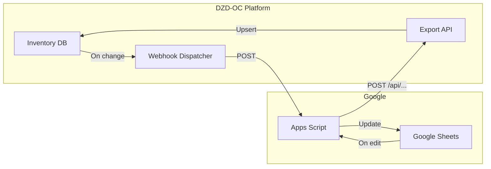

# Pharmacy Management System Architecture

> **Status:** IMPLEMENTED (Full PharmaX-Level Feature Set)

## What's Been Built

### Core Inventory (Phase 1 - Complete)
- Product catalog with barcode, DCI, categories
- Multi-batch inventory with FEFO
- Stock alerts (low, expiring, expired)
- Supplier management
- Transaction history with audit trail
- Chifa/CNAS pricing and reimbursement calculations

### Integrations (Phase 2 - Complete)
- API key authentication for external software
- Webhook system for real-time sync
- CSV/JSON export
- Bulk import API
- Google Sheets integration guide

### POS & Retail (Phase 3 - Complete)
- Full Point of Sale terminal
- Cart management with Chifa split calculation
- Multi-payment (cash, card, mobile)
- Automatic stock deduction
- Receipt generation

### Treasury (Phase 4 - Complete)
- Cash drawer management
- Session open/close with balance
- Daily reconciliation
- Variance tracking

### Multi-Warehouse (Phase 5 - Complete)
- Multiple stock locations
- Warehouse types (storage, sales floor, refrigerated, controlled)
- Inter-warehouse transfers
- Transfer workflow (request → ship → receive)

### Procurement (Phase 6 - Complete)
- Purchase orders
- Order wizard based on stock rotation
- Automatic PO suggestions (out-of-stock, low-stock, rotation)
- PO → stock receipt flow

### Customer Loyalty (Phase 7 - Complete)
- Customer database
- Chifa card/NSS tracking
- Loyalty points (1 pt per 100 DZD)
- Points earn/redeem history
- Loyalty tiers (bronze → platinum)

### Chifa Claims (Phase 8 - Complete)
- Automatic claim queue from sales
- Batch tracking for monthly submission
- Claim status workflow

---

## Overview

This document outlines how to link pharmacy inventory to existing databases, optimize for multi-service/multi-pharmacy use, and integrate auto-sync with Google Sheets and other software.

---

## 1. Current State: How Inventory Connects

### Database Layer (Supabase PostgreSQL)

Inventory already lives in your main Supabase database:

```
professionals (pharmacies)     →  pharmacy_products
       ↓                              ↓
pharmacy_id                    pharmacy_inventory
       ↓                              ↓
pharmacy_suppliers             inventory_transactions
```

- **Multi-tenant**: Each pharmacy has isolated data via `pharmacy_id`
- **Single source of truth**: All data in Supabase
- **No external DB link today**: Products/stock are created only via the app or CSV import

### What's Missing for Integrations

| Need | Current | Gap |
|------|---------|-----|
| Link to external DB | None | No adapter for Excel, Access, MySQL, etc. |
| API for external software | Auth-only (session) | No API keys for headless/integration use |
| Webhooks / event sync | None | No way to push changes to Google Sheets, Zapier, etc. |
| Google Sheets sync | None | No export/import or bidirectional sync |
| Prescription → inventory | None | Dispensing doesn't deduct stock |

---

## 2. Linking to Existing Databases

### Option A: Your Supabase (Already Linked)

Inventory **is** in your existing database. Each pharmacy's data is scoped by `pharmacy_id`:

- `pharmacy_products` → `pharmacy_id` → `professionals.id`
- `pharmacy_inventory` → `pharmacy_id`
- `inventory_transactions` → `pharmacy_id`

**Use case**: Multiple pharmacies, each with its own catalog and stock. No extra linking needed.

### Option B: External Product Catalogs (Import / Sync)

| Source | Method | Use Case |
|--------|--------|----------|
| **LNCPP** (Algerian meds) | API integration (future) | National product catalog |
| **Excel/CSV** | Import wizard (planned) | Supplier price lists, legacy data |
| **Other SQL DB** | ETL script or API bridge | Migrate from old system |

**Implementation**:

1. **CSV/Excel import** (Phase 1): Map columns → `pharmacy_products`, optional `pharmacy_inventory`
2. **LNCPP API** (Phase 2): Fetch products by barcode/DCI, create/update in `pharmacy_products`
3. **External DB bridge**: Cron job or API that reads from MySQL/PostgreSQL and upserts into Supabase

### Option C: Sync FROM External DB (Read-Only Link)

For pharmacies that keep a master catalog elsewhere:

```
External DB (MySQL, Excel, etc.)
    → Scheduled job / Zapier
    → POST /api/pharmacy/inventory/products/import
    → Upsert into pharmacy_products
```

Requires:
- API endpoint that accepts bulk product data (JSON/CSV)
- API key auth for the external system
- Idempotent upsert (match by `barcode` or `external_id`)

---

## 3. Multi-Service Architecture (Many Pharmacies)

### Current Model

- One Supabase project
- One `professionals` table with `type = 'pharmacy'`
- RLS: each pharmacy sees only its own data via `pharmacy_id`

### Optimizations for Many Services

| Concern | Solution |
|---------|----------|
| **Scale** | Add indexes on `pharmacy_id`, `barcode`; paginate large lists |
| **Rate limits** | Add per-pharmacy rate limiting for API calls |
| **Integrations** | One integration config per pharmacy (see below) |
| **Isolation** | RLS already enforces; add `pharmacy_integrations` table |

### Proposed: Integrations Table

```sql
-- Pharmacy-specific integration configs
CREATE TABLE pharmacy_integrations (
  id UUID PRIMARY KEY,
  pharmacy_id UUID NOT NULL REFERENCES professionals(id),
  integration_type TEXT NOT NULL,  -- 'google_sheets', 'zapier', 'api_key', 'webhook'
  config JSONB NOT NULL,          -- { "spreadsheet_id", "sheet_name" } or { "webhook_url" }
  is_active BOOLEAN DEFAULT TRUE,
  last_sync_at TIMESTAMPTZ,
  created_at TIMESTAMPTZ DEFAULT NOW()
);

-- API keys for external software (per pharmacy)
CREATE TABLE pharmacy_api_keys (
  id UUID PRIMARY KEY,
  pharmacy_id UUID NOT NULL REFERENCES professionals(id),
  key_hash TEXT NOT NULL,         -- hashed key, never store plaintext
  name TEXT,                      -- "Google Sheets sync", "POS System"
  scopes TEXT[],                  -- ['products:read', 'stock:write']
  expires_at TIMESTAMPTZ,
  last_used_at TIMESTAMPTZ,
  created_at TIMESTAMPTZ DEFAULT NOW()
);
```

---

## 4. Auto-Sync with Google Sheets

### Flow



### Option 1: One-Way Push (Platform → Sheets)

1. **Webhook** fires when products or stock change
2. Webhook calls a **Google Apps Script** Web App URL
3. Apps Script appends/updates rows in a Sheet

**Setup**:
- Create Apps Script: `doPost(e)` that parses JSON and updates Sheet
- Deploy as Web App, get URL
- Store URL in `pharmacy_integrations` for that pharmacy
- On product/stock change, `fetch(webhookUrl, { body: JSON.stringify(payload) })`

### Option 2: One-Way Pull (Sheets → Platform)

1. User clicks "Sync from Sheet" in the dashboard
2. Frontend calls `GET /api/pharmacy/inventory/export?format=template`
3. User pastes template, fills data, uses "Import from Sheet" to paste CSV
4. Or: Apps Script runs on timer, fetches `GET /api/.../products?api_key=xxx`, writes to Sheet

### Option 3: Bidirectional (Full Sync)

1. **Webhook** on every change → POST to Apps Script → update Sheet
2. **Sheet OnEdit** trigger → Apps Script → POST to platform API (with API key) → upsert products/stock
3. Conflict handling: last-write-wins or timestamp-based merge

**Requirements**:
- API key auth for Apps Script → Platform
- Idempotent upsert endpoint
- Webhook secret for Platform → Apps Script

---

## 5. Webhook System (Hook for Other Software)

### Events to Emit

| Event | When | Payload |
|-------|------|---------|
| `product.created` | New product | `{ product }` |
| `product.updated` | Product edited | `{ product, changes }` |
| `stock.received` | Stock receipt | `{ product_id, quantity, batch }` |
| `stock.adjusted` | Adjustment | `{ product_id, quantity_change, reason }` |
| `stock.low` | Below min level | `{ product_id, current, min }` |
| `stock.expiring` | Batch expires in 30d | `{ product_id, batch, expiry_date }` |

### Webhook Delivery

```
POST {subscriber_url}
Headers: X-Webhook-Signature: sha256=...
Body: { "event": "stock.received", "pharmacy_id": "...", "data": {...}, "timestamp": "..." }
```

- Store subscriber URLs in `pharmacy_integrations` (type = 'webhook')
- On event: async `fetch` to each URL; retry 3x on failure
- Use background job (Vercel serverless or cron) to avoid blocking main flow

### Software That Can Consume Webhooks

- **Zapier** – Connect to Google Sheets, Airtable, Slack
- **Make (Integromat)** – Same
- **n8n** – Self-hosted automation
- **Custom apps** – Any HTTP endpoint

---

## 6. REST API for External Software

### API Key Auth

```
GET /api/pharmacy/inventory/products?api_key=pk_xxx
```

- Validate `api_key` → lookup `pharmacy_api_keys`, get `pharmacy_id`
- Apply same RLS logic: scope all queries to that pharmacy

### Endpoints for Integrations

| Method | Endpoint | Use |
|--------|----------|-----|
| GET | `/api/pharmacy/inventory/products` | List products (paginated) |
| GET | `/api/pharmacy/inventory/stock` | List stock levels |
| GET | `/api/pharmacy/inventory/transactions` | Movement history |
| POST | `/api/pharmacy/inventory/products/import` | Bulk upsert products |
| POST | `/api/pharmacy/inventory/stock` | Add stock (receive) |
| POST | `/api/pharmacy/inventory/adjustments` | Stock adjustment |

### Export Formats

| Format | Use |
|--------|-----|
| `?format=json` | Default, for APIs |
| `?format=csv` | Import into Excel, Google Sheets |
| `?format=xlsx` | Direct Excel download (if library added) |

---

## 7. Implementation Roadmap

### Phase 1: Foundation (Immediate)

| Task | Effort | Delivers |
|------|--------|----------|
| API key table + generation | 1 day | Keys for external access |
| API key middleware | 0.5 day | Auth for `?api_key=xxx` |
| CSV export endpoint | 0.5 day | `GET .../products?format=csv` |
| `pharmacy_integrations` table | 0.5 day | Store webhook URLs, Sheet URLs |

### Phase 2: Webhooks

| Task | Effort | Delivers |
|------|--------|----------|
| Event emitter helper | 0.5 day | `emitInventoryEvent('stock.received', data)` |
| Webhook dispatcher | 1 day | Call subscriber URLs on events |
| UI: Integration settings | 1 day | Add webhook URL, test button |

### Phase 3: Google Sheets

| Task | Effort | Delivers |
|------|--------|----------|
| Apps Script template | 0.5 day | `doPost` + sample Sheet |
| Webhook → Sheet push | 0.5 day | On change, POST to Apps Script |
| Import from Sheet (paste CSV) | 0.5 day | User pastes, we parse and upsert |

### Phase 4: External DB / Advanced

| Task | Effort | Delivers |
|------|--------|----------|
| Bulk import API | 1 day | `POST .../products/import` (JSON array) |
| LNCPP placeholder | 0.5 day | `lib/integrations/lncpp.ts` stub |
| Scheduled sync job | 1 day | Cron: fetch external source → upsert |

---

## 8. Files to Create/Modify

### New Files

- `lib/inventory/webhooks.ts` – Emit events, dispatch to subscribers
- `lib/inventory/api-keys.ts` – Validate API key, get pharmacy_id
- `app/api/pharmacy/inventory/webhooks/route.ts` – Register/test webhooks
- `app/api/pharmacy/inventory/export/route.ts` – CSV/JSON export
- `app/api/pharmacy/inventory/import/route.ts` – Bulk import
- `scripts/069-pharmacy-integrations.sql` – `pharmacy_integrations`, `pharmacy_api_keys`
- `docs/google-sheets-apps-script.js` – Sample Apps Script for sync

### Modified Files

- All inventory API routes – Add API key auth fallback
- `app/api/pharmacy/inventory/stock/route.ts` – Emit `stock.received` after insert
- `app/api/pharmacy/inventory/adjustments/route.ts` – Emit `stock.adjusted`
- `app/api/pharmacy/inventory/products/route.ts` – Emit `product.created`/`updated`
- `app/professional/dashboard/.../inventory/` – Add "Integrations" tab

---

## 9. Summary

| Goal | Solution |
|------|----------|
| **Link to existing DB** | Inventory is in Supabase; add import API for Excel/external sources |
| **Many services** | Already multi-tenant; add `pharmacy_integrations` + API keys |
| **Google Sheets sync** | Webhooks → Apps Script; CSV export/import |
| **Other software** | Webhooks + REST API with API keys |

Next step: implement Phase 1 (API keys, CSV export, integrations table), then Phase 2 (webhooks).
